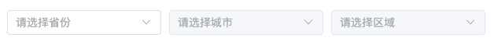
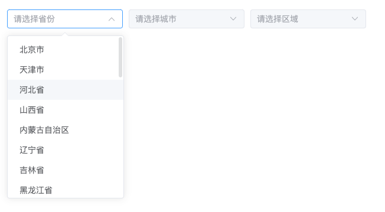
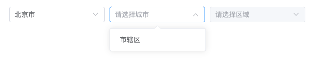
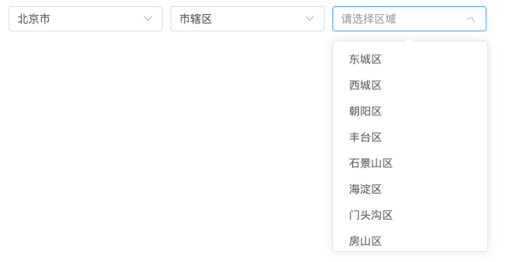
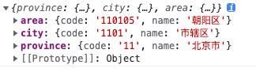

# 省市区选择器

## 1.样式展示

### 1.引入样式展示


### 2.弹出框样式





## 2.实例代码
```js
//可以使用solt 或者 title传递参数
//v-model:visible="visible"绑定隐藏或者展示
//type 传递按钮类型
```
```vue
  <ChooseAreaSrc @areaChange="change"/>
```
```js
const change = (val)=>{
    console.log(val)
}
```
### 打印结果
在最后市区选择完触发change事件返回值为省市区
