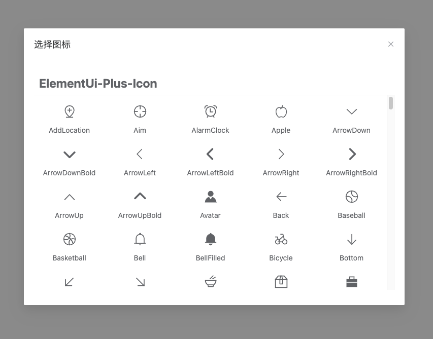
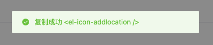

# 图标选择器

## 1.样式展示

### 1.引入样式展示


### 2.弹出框样式


### 3.复制后弹出框提示



## 2.实例代码
```js
//可以使用solt 或者 title传递参数
//v-model:visible="visible"绑定隐藏或者展示
//type 传递按钮类型
```
```vue
  <ChooseIconSrc title="选择图标" v-model:visible="visible" type="success" >
    选择图标
  </ChooseIconSrc>
```
## 3.使用效果
图标代码已复制到剪贴板，请粘贴到页面中使用即可
```vue
<el-icon-alarmclock />
```