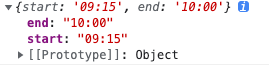

# 时间选择器

## 1.样式展示


## 2.实例代码

```js
//(可选参数)startPlaceholder 开始时间的占位符
//(可选参数)endPlaceholder 结束时间的占位符
//(可选参数)start 开始时间
//(可选参数)end 结束时间
//(可选参数)step 步长，默认为1，可选值为：1,2,3,4,5,6,10,12,15,20,30
```
```typescript
//可选参数类型
startPlaceholder?:string
endPlaceholder?:string
start?:string
end?:string
step?:string
```
```vue
  <ChooseTimeSrc @change="handelChange"/>
```
```js
  handelChange(val) {
    console.log(val)
  }
```
### 打印结果
在选完结束时间后触发

