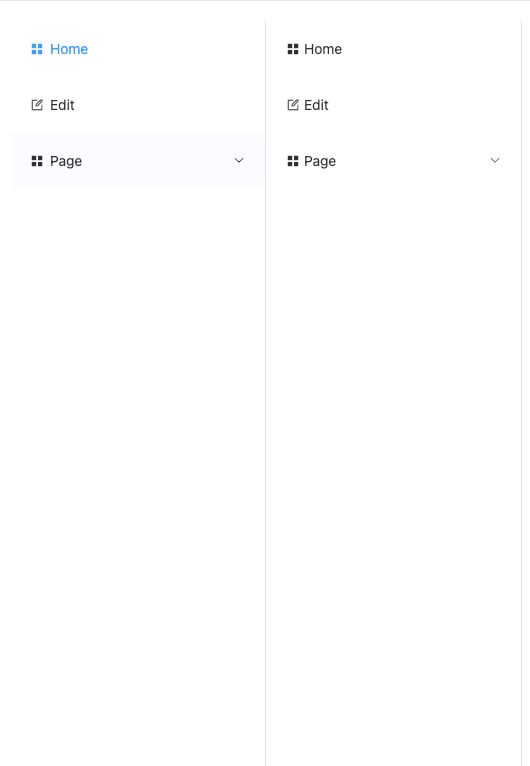
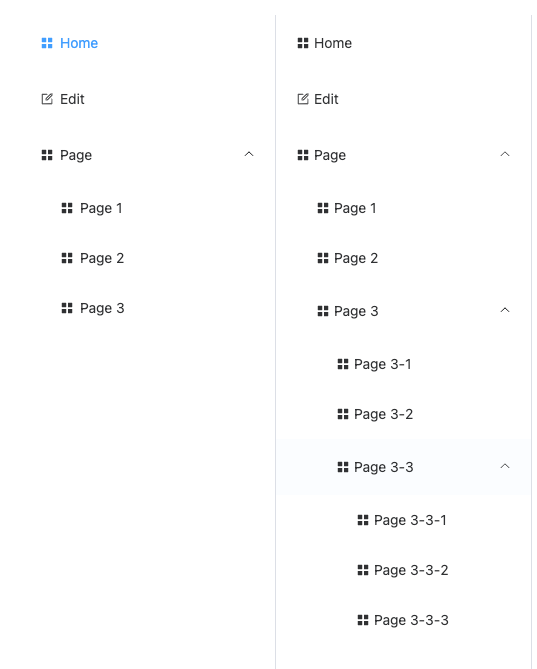

# 侧边菜单栏

## 1.样式展示

### 1.引入样式(未展开)展示


### 2.引入样式(展开)展示

## 2.实例代码

```js
//两层级使用 MenusSrc
//无限层级使用 InfiniteMenu
//title 为菜单标题
//icon(可选参数) 为菜单图标
//index:string 为菜单索引
//i 为菜单项的附加属性(使用时无需传递)
//children(可选参数) MenuItem[]
```
数据格式类型
```ts
export interface MenuItem{
    title:string
    icon?:string
    index:string
    i?:any
    children?:MenuItem[]
}
```
```vue
<div>
<MenusSrc :data="data"/>
</div>
<div>
<InfiniteMenu :data="infiniteData"/>
</div>
```