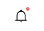
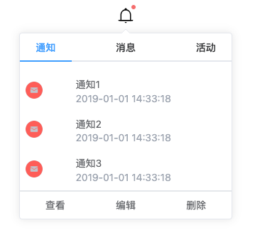

# 消息通知

## 1.样式展示

### 1.引入样式展示



### 2.弹出框样式



## 2.实例代码
```vue
<NotificationSrc value="118" isDot>
<ListSrc
    @clickItem="clickItem"
    @clickAction="clickAction"
    :list='options'
    :actions="actions">
</ListSrc>
</NotificationSrc>
```
```js
//options 参数介绍
    //avatar 头像链接
    //title 标题
    //description 描述
    //time 时间
    //tag 标签
    //tagType 标签类型 "" | "primary" | "success" | "warning" | "danger" | "info";
//actions 参数介绍
    //title 按钮标题
    //icon 按钮图标
```
```js
//点击列表
const clickItem = (val:{item: ListItem,index:number}) => {
  console.log(val);
};
//点击按钮
const clickAction = (val:{actions:ActionOptions,index:number})=>{
  console.log(val);
}
```
### 数据格式
```ts
export interface ListItem{
    avatar?: string;
    title?: string;
    description?: string;
    time?: string;
    tag?: string;
    tagType?: "" | "primary" | "success" | "warning" | "danger" | "info";
}

export interface ListOptions{
    title: string;
    content: ListItem[];
}

export interface ActionOptions{
    title: string;
    icon?: string;
}
```