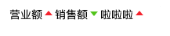

# 趋势标记

## 1.样式展示



## 2.实例代码

```js
//text 和 slot 都可以传入文字
//classType  可以传入up或者down 来规定上升下降趋势
//(可选参数)upIconColor 上升趋势图标颜色
//(可选参数)downIconColor 下降趋势图标颜色
//(可选参数)reverseColor 是否翻转颜色
//(可选参数)upTextColor 上升趋势文字颜色
//(可选参数)downTextColor 下降趋势文字颜色
//(可选参数)upIcon 上升趋势图标
//(可选参数)downIcon 下降趋势图标
```
```typescript
//可选参数类型
upIconColor?: string;
downIconColor?: string;
reverseColor?: boolean;
upTextColor?: string;
downTextColor?: string;
upIcon?: string;
downIcon?: string;
```
```vue
<TrendSrc text="营业额" classType="up"/>
<TrendSrc text="销售额" classType="down"/>
<TrendSrc text="订单量" classType="up">
啦啦啦
</TrendSrc>
```
